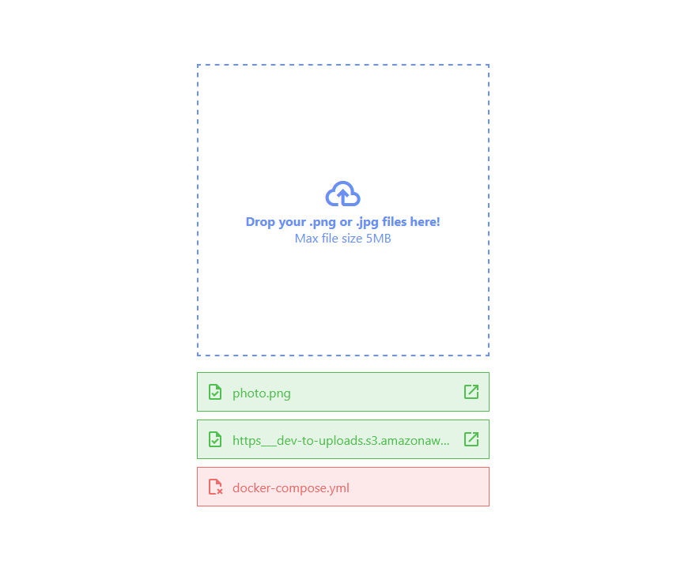

# File Uploader

This project is a web-based file uploader that allows users to upload `.png` or `.jpg` files with a maximum size of 5MB. It features drag-and-drop functionality, file validation, progress tracking, and error handling. The backend is powered by [Hono](https://hono.dev/), and the frontend is implemented using vanilla javascript.

## Features

- Drag-and-drop file upload.
- File validation (type and size).
- Real-time upload progress tracking.
- Error handling for invalid files or server issues.
- Displays a list of uploaded files with clickable links to view them.
- Custom file router
- Decorator middlewares

## Technologies Used

- **Frontend**: HTML, CSS, Javascript.
- **Backend**: [Hono](https://hono.dev/) - a lightweight web framework for building APIs, Typescript.

## License

This project is licensed under the MIT License. See the [LICENSE](LICENSE) file for details.